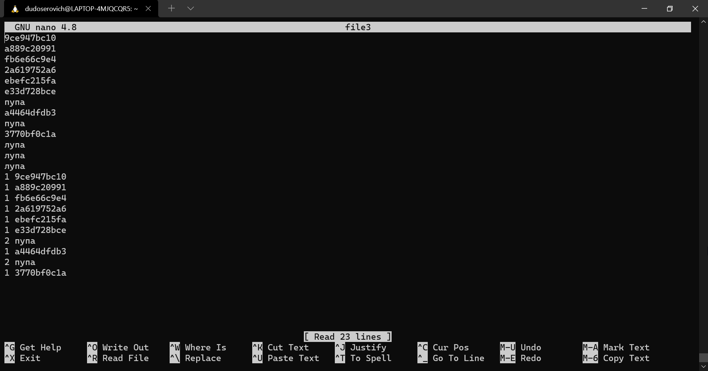

# work_1

## Задание
Имеется многострочный файл - file1, в котором есть повторяющиеся строки (1000 строк). 

**Необходимо выполнить следующую последовательность:**
- Выбрать из file1 40 последних строк и записать в file2. 
- Записать первые 10 строк из file2 в file3.
- Выбрать в file2 все строки которые содержат "коко", заменить строку "коко" на "куку" и дописать только первые три вхождения в file3.
- Оставить только уникальные строки в file3 и получить количества каждой уникальной строки в виде: КОЛ-ВО СТРОКА.

### Создаём скрипт, генирирующий нам файл *file1* с рандомными словами
```
touch 1.sh;  
chmod 777 1.sh;   
nano 1.sh;  
```

### Сам скрипт('./1.sh'):
```bash
#!/bin/bash

file=./file1

if [ -e $file ]; then
        touch $file
else
        echo "" > $file
fi

for _ in {1..500}; do
        random=$(($RANDOM%2))
        #echo $random
        if (( random == 0 )); then
                echo "пупа" >> $file
        else
                cat /dev/urandom | head -n 10 | md5sum | head -c 10 >> $file
                echo "" >> $file
        fi
done
```
### Создаём второй файлик - *file2*, cодержащий 40 последних строк из *file1*
```
touch file2; 
chmod 777 file1 file2; 
cat ./file1 | tail -n 40 > file2
```
### Создаём *file3* и записываем туда первые 10 строчек из *file2*
```
touch file3
chmod 777 file3
cat ./file2 | head -n 10 > file3
cat file3
```
### Выбираем из *file2* строчки, содержащие "пупа", заменяя на "лупа" и записываем только первые 3 вхождения в *file3*
```
grep пупа ./file2 -P -R -I -l | xargs sed -i 's/пупа/лупа/g'
grep лупа ./file2 | head -n 3 >> file3
```
### Найдём уникальные строки и запишем их в отдельный файл
```
uniq -u file3 > unical
```
### Напишем скрипт, который запишет в конец файла уникальные строки и их количество
```bash
#!/bin/bash

# Выписываем все уникальные слова
unical=$(cat ./unical)
while IFS= read -r line; do my_array+=($line); done <<< "$unical"

#echo "Уникальность:"
for i in "${my_array[@]}"
do
    count_find=$(grep $i file3 | wc -l)
    echo -e "$count_find $i"
done
```
### Записываем в file3 уникальные строки с их количеством
Для этого создадим вспомогательный файл, содержащий строчки, которые будут дописаны в конец файла
```
touch help_file 
chmod 777 help_file
./2.sh > help_file
cat help_file >> file3
```
### По итогу у меня получился файл со следующим содержимым:

Почему-то *uniq -u* отработал не так, как я думал и посчитал, что "пупа" является уникальной строкой, хоть и встречается 2 раза. 

В любом случае я заколебался, поставьте GL, пожалуйста :D